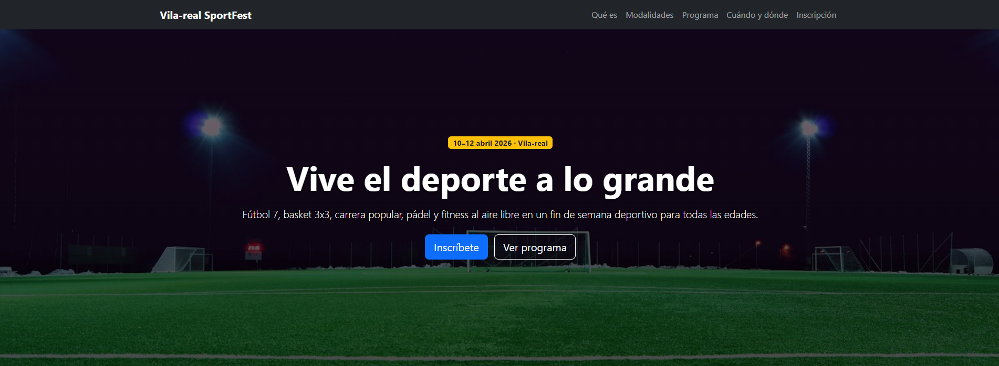

# Vila-real SportFest 2026

Este es el repositorio del sitio web del Vila-real SportFest 2026, el evento deportivo que este año vuelve a las instalaciones municipales de Vila-real con más fuerza que nunca.

## Descripción del proyecto

He creado una página web informativa para el Vila-real SportFest 2026, un evento organizado por el Ayuntamiento de Vila-real que se celebrará los días 10, 11 y 12 de abril de 2026.

La web está pensada para que la gente pueda enterarse bien de qué va el evento, qué deportes hay, los horarios y cómo contactar con la organización. Me he centrado en que sea clara, que se vea bien tanto en el móvil como en el ordenador, y que tenga un diseño llamativo pero sin ser demasiado recargada.

Para maquetarla he usado Bootstrap 5, que me ha ayudado mucho a hacerla responsive sin tener que escribir demasiado CSS desde cero.

## Secciones y columnas de Bootstrap

Aquí explico cómo he organizado cada sección de la página y cómo he usado el sistema de columnas de Bootstrap en cada una:

**Navbar**  
Barra de navegación superior fija con fondo oscuro. Ocupa todo el ancho (12 columnas) y se colapsa en móvil con el menú hamburguesa. Incluye enlaces a todas las secciones.

**Hero**  
Cabecera principal con imagen de fondo, título grande y dos botones. También ocupa las 12 columnas. Le he puesto una capa oscura encima para que el texto se lea bien.

**Qué es**  
Texto explicativo a la izquierda (col-md-6) e imagen a la derecha (col-md-6). Usa gutter g-4 para separar bien el contenido.

**Modalidades**  
Aquí he usado columnas responsivas: 1 en móvil , 2 en tablet  y 4 en escritorio  para mostrar las cards de cada deporte. En total tengo 4 deportes: fútbol 7, basket 3x3, carrera 5K, y pádel con fitness.

**Programa e info**  
Dividido en dos columnas:
- Columna izquierda (col-lg-7): programa con lista de actividades.
- Columna derecha (col-lg-5): información práctica con fechas, lugar y requisitos, más una foto.

**Contacto**  
Sección con fondo oscuro. El formulario de contacto va centrado en una columna de 8 (col-lg-8) y dentro una tarjeta con los datos para inscribirse.

**Footer**  
Dividido en dos partes con flexbox: copyright a la izquierda y organización a la derecha. En móvil se apilan.

## Componentes de Bootstrap que he usado

He intentado aprovechar los componentes que trae Bootstrap para ahorrar trabajo y darle un aspecto más profesional:

**Navbar** → Para el menú de navegación, con el típico menú hamburguesa en móvil y fondo oscuro.

**Grid system** → Para maquetar todas las secciones, sobre todo en "Qué es", "Modalidades" y "Programa".

**Cards** → En la sección de deportes, cada modalidad va dentro de una card con imagen, título, descripción y un badge en el footer.

**Botones** → Para los llamados a la acción: botón azul de "Inscríbete" y botón outline en el hero.

**List group** → En el programa, para mostrar los horarios de viernes a domingo de forma ordenada.

**Badges** → Los he puesto en varias partes:
- En el hero, un badge con la fecha del evento.
- En las cards de modalidades, para indicar categorías y detalles.
- Con colores diferentes (primary, success, danger, info) para que quede más vistoso.

**Utilities** → Clases como py-5, g-4, text-center, shadow, etc., para ajustar espacios y dar sombras.

### Rama principal: main

**feat: estructura inicial del proyecto**  
Primer commit con el esqueleto básico: archivo Pagina_WEB.html con la estructura HTML, enlaces a Bootstrap puestos y navbar creado.

**feat: seccion "que-es" con grid de 2 columnas**  
Añadida la sección que explica el evento, con texto a un lado y foto al otro usando las columnas de Bootstrap.

**feat: seccion "programa" con list-group**  
Creada la parte del horario e información práctica. Usé list-group para los días y lo dividí en dos columnas.

### Rama secundaria: feature/mejora-modalidades

Me creé esta rama para tocar la sección de deportes sin miedo a romper lo que ya funcionaba:

**feat: crear rama feature/mejora-modalidades**  
Primero creé la rama nueva desde GitHub y luego la bajé a mi ordenador.

**style: mejorar diseño de las cards en modalidades**  
Aquí retoqué las cards: les puse sombra suave (shadow-sm) y un alto fijo para las imágenes (height: 200px con object-fit cover).

**feat: añadir badges a las cards de deportes**  
Añadí badges en el footer de cada card para mostrar información extra (categorías, dorsal incluido, plazas limitadas, etc.). Cada badge con un color diferente.

**fix: ajustar columnas en móvil para seccion modalidades**  
Me di cuenta de que en móvil las cards se veían muy pequeñas, así que ajusté las columnas para que ocuparan todo el ancho en móvil y se vieran bien.

### Fusión a main

**Merge pull request #1 from feature/mejora-modalidades**  
Cuando terminé los cambios en la rama secundaria, hice un pull request desde GitHub para fusionarlo con la rama principal y lo acepté después de comprobar que todo iba bien.

**Update README.md**  
Último commit subiendo este archivo con toda la documentación del proyecto y añadiendo las capturas de pantalla.

## La mayor dificultad que encontré y cómo la solucioné

Lo que más me costó fue ajustar el hero section con la imagen de fondo y la capa oscura encima para que el texto se viera bien.

Al principio probé a poner la imagen directamente con una etiqueta img, pero no conseguía que ocupara todo el alto ni que el texto quedara centrado encima. Luego intenté con background-image en CSS pero me salía repetida la imagen o no se adaptaba bien.

Cómo lo solucioné:  
Busqué en internet cómo hacer un hero section con Bootstrap y encontré la solución: usar min-height en vh, background-image con linear-gradient para la capa oscura, y background-size: cover. También tuve que ajustar el display: flex y align-items: center para centrar el texto verticalmente. Para las sombras del texto usé text-shadow y quedó mucho más legible.

Otra cosa que me costó fue que las imágenes de las cards no se veían bien, algunas se deformaban. Lo solucioné dándoles un height fijo y object-fit: cover para que todas tuvieran el mismo tamaño sin deformarse.

## Capturas de pantalla

En la carpeta capturas/ he dejado varias fotos del resultado final:

**Captura.PNG** → Vista general de la página completa en ordenador.

**Captura2.PNG** → Sección del hero y qué es.

**Captura3.PNG** → Sección de modalidades con las cards y los badges.

**Captura4.PNG** → Sección de programa e información práctica.

**Captura5.PNG** → Parte de contacto y footer.

